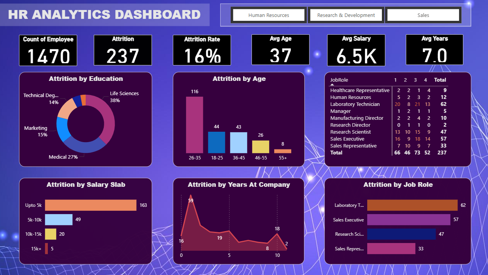

# HR Analytics Dashboard

## Project Overview
This project analyzes employee data to understand workforce trends and employee attrition using Power BI. The dashboard helps HR teams identify patterns in employee turnover and supports data-driven decision making.

## Dataset
The dataset contains employee information such as:
- Age
- Department
- Education
- Job Role
- Salary
- Years at Company
- Attrition Status

## Dashboard Insights
The dashboard provides insights including:

- Total Employees
- Attrition Count
- Attrition Rate
- Average Age
- Average Salary
- Average Years at Company
- Attrition by Education
- Attrition by Age
- Attrition by Salary Slab
- Attrition by Job Role

## Tools Used
- Power BI
- Microsoft Excel
- Data Visualization
- Data Analysis

## Dashboard Preview

